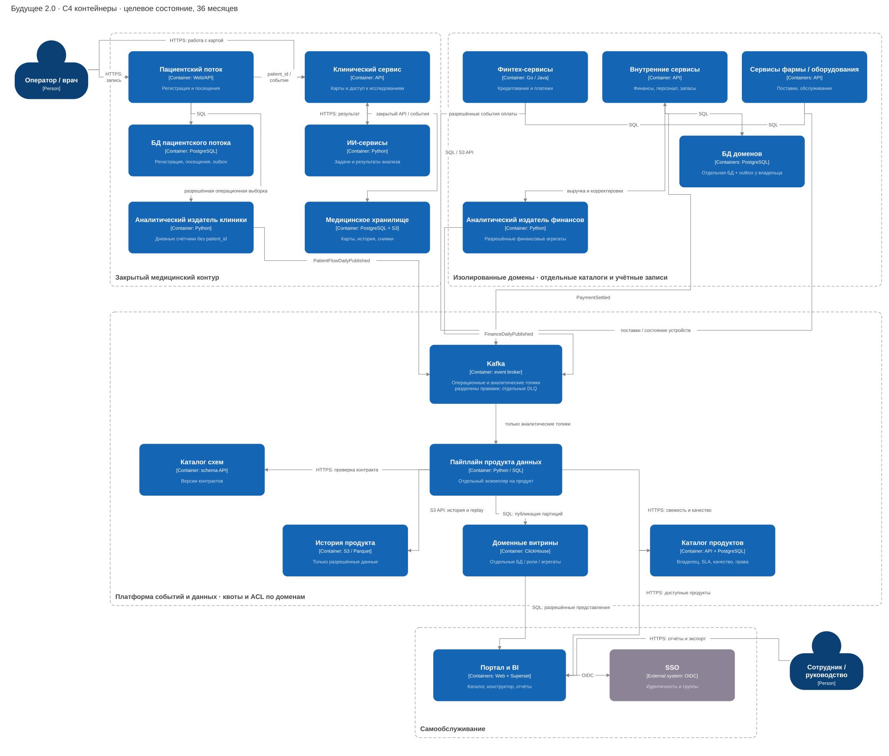
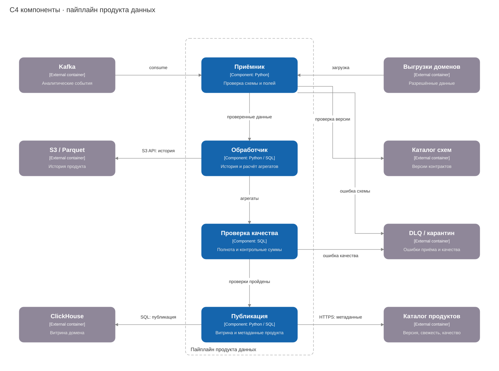

# Целевая архитектура

Выносим бизнес-правила из DWH в доменные сервисы. Это позволит подключать новые направления без доработки общей базы и отдельно масштабировать отчётность.

## Контейнеры

У доменов свои БД PostgreSQL и контракты событий Kafka. S3 хранит разрешённую историю, ClickHouse — отчётные агрегаты. За качество и свежесть продукта данных отвечает команда домена.

В портале на Superset сотрудник открывает готовый отчёт или собирает свой в пределах роли. Права проверяются при запросе и экспорте. Медкарты, истории болезни и результаты исследований остаются в закрытом медицинском контуре и в аналитику не попадают.

Фарма и оборудование подключаются через новые контракты. Для двух-трёх новых регионов создаём отдельные контуры, в головной офис передаём разрешённые агрегаты. Критичные сервисы резервируем по зонам, храним резервные копии на отдельной согласованной площадке.

## Компоненты продукта данных

Приёмник проверяет схему и разрешённые поля. Обработчик сохраняет историю и строит агрегаты, проверка качества сверяет результат. После успешной проверки публикуем витрину и обновляем каталог; ошибки отправляем в DLQ.

## Переход

Начинаем с выручки и пациентского потока. Camel и DWH временно оставляем за ACL — адаптером старой модели. Перед переключением сверяем данные, у каждой сущности сохраняем один источник записи.

PowerBuilder заменяем веб-интерфейсом, отчёты Power BI — порталом к концу первого года. SQL Server отключаем после переноса бизнес-правил и клинического архива. К третьему году домены взаимодействуют через события без Camel/DWH на критическом пути.

[Риски и меры](risks.md) · [Этапы и роли](../Task5Advanced/roadmap.md)
