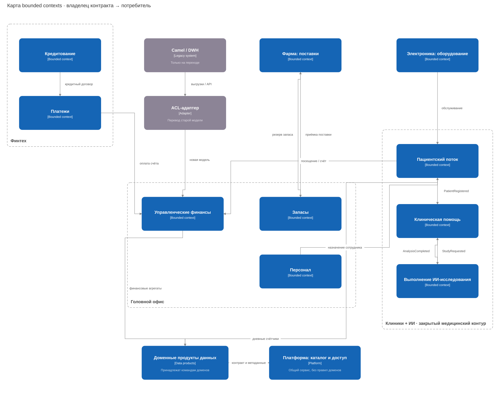

# Границы доменов

 [Агрегаты](aggregates.md) · [События](events.md) · [Обоснование](justification.md)

| домен / bounded context | за что отвечает |
| --- | --- |
| клиники / пациентский поток | регистрация пациента, запись, посещение; без истории болезни |
| клиники / клиническая помощь | карты, исследования, назначения и права медицинского персонала |
| ИИ / выполнение исследования | задача анализа, модель, статус и результат в закрытом контуре |
| финтех / кредитование | заявки и кредитные договоры |
| финтех / платежи | движение денег и финансовый статус платежа |
| головной офис / управленческие финансы | признание выручки, счета за услуги, консолидация |
| головной офис / персонал | сотрудники, подразделения, назначение на должности |
| головной офис / запасы | остатки, резервирование, приёмка и списание |
| фарма / поставки | заказы и партии лекарств |
| электроника / оборудование | устройство, обслуживание, техническая телеметрия |
| данные / доменные продукты | наборы, качество и показатели домена |
| платформа / каталог и доступ | каталог, схемы, SSO и политики доступа |

Пациентский поток и клиническая помощь обмениваются внутренним `patient_id`. ИИ работает внутри медицинского контура. Банк использует собственную модель клиента; с оплатой услуги связывается через `invoice_id`, без диагноза.

Стрелки идут от владельца контракта к потребителю. Новые домены обмениваются событиями, Camel/DWH подключены через ACL только на время перехода.
