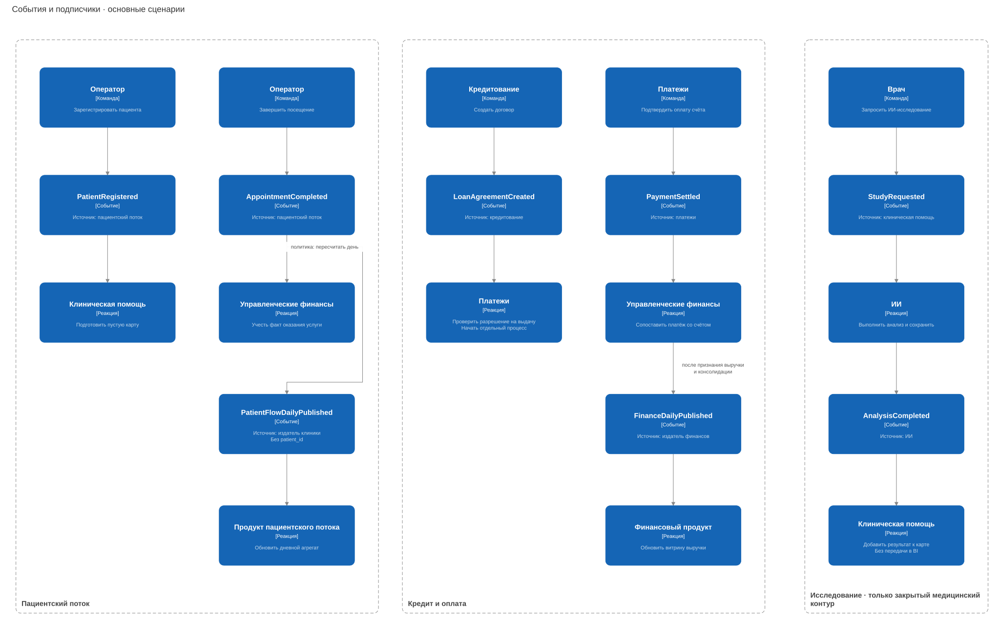

# Каталог событий

Общие поля: `event_id`, `event_type`, `schema_version`, `occurred_at`, `aggregate_id`, `data`. В таблице — содержимое `data`; суммы передаём в минимальных денежных единицах.

| событие / смысл | источник → подписчики | минимальные поля data | контур |
|---|---|---|---|
| PatientRegistered / пациент зарегистрирован | пациентский поток → клиническая помощь | patient_id, clinic_id | медицинский |
| AppointmentCompleted / посещение завершено | пациентский поток → управленческие финансы | appointment_id, invoice_id, clinic_id, completed_at | операционный, без медицинских деталей |
| StudyRequested / задание на исследование принято | клиническая помощь → ИИ | analysis_id, record_id, input_ref | медицинский |
| AnalysisCompleted / результат ИИ сохранён | ИИ → клиническая помощь | analysis_id, result_ref, model_version | медицинский |
| LoanAgreementCreated / договор создан, ещё не равен выдаче денег | кредитование → платежи | agreement_id, disbursement_request_id, amount_minor, currency | банковский |
| PaymentSettled / платёж подтверждён | платежи → управленческие финансы | payment_id, invoice_id, amount_minor, currency | междоменный |
| ShipmentReceived / поставка принята | фарма → запасы | shipment_id, warehouse_id, lines: sku/batch_id/quantity | операционный |
| DeviceMaintenanceRequired / требуется обслуживание | оборудование → управление клиниками | device_id, clinic_id, reason_code | технический, без сигналов пациента |
| PatientFlowDailyPublished / опубликованы дневные счётчики | аналитический издатель клиники → продукт пациентского потока | clinic_id, date, visits_count, revision | аналитика; нет patient_id/appointment_id |
| FinanceDailyPublished / опубликованы финансовые агрегаты | аналитический издатель финансов → финансовый продукт | business_unit_id, date, revenue_minor, currency, revision | аналитика; внутригрупповые обороты исключены |

Изменение и outbox сохраняем одной транзакцией. Доставка допускает повторы, потребитель учитывает `event_id`. После нескольких неудачных попыток отправляем событие в DLQ. Версии контрактов храним в каталоге схем.

Медицинские события и ссылки на результаты не выходят из закрытого контура. `LoanAgreementCreated` не означает выдачу денег: платёжный сервис проверяет разрешение отдельно.

Дневные агрегаты публикуются без данных пациента и банковских реквизитов. Новая `revision` заменяет прежний итог, а не прибавляется к нему. Финансовая витрина обновляется каждые пять минут, пациентская — раз в день.
